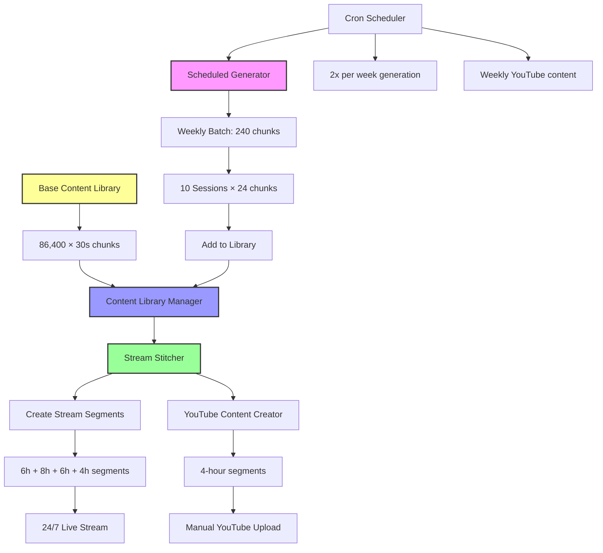

# Indian Lofi YouTube Live Stream System (Pre-built Content Library)

## Overview
A 24/7 YouTube live stream system using pre-built Indian lofi music content. The system maintains a **content library of 30-second audio chunks** with sustainable weekly generation and automated stream stitching.

## System Architecture

```
[Base Content Library] → [Weekly Additions] → [Stream Stitcher] → [YouTube Live]
    (1 Month = 86,400 files)    (240 files/week)     (Continuous Streams)
```

### Key Innovation: Content Library System
- **Base Library**: 86,400 × 30-second chunks (1 month of content)
- **Weekly Generation**: 240 chunks/week (2 hours of new content)
- **Stream Stitching**: Pre-built continuous streams from chunk library
- **YouTube Content**: 4-hour segments created weekly for manual upload

## Content Mathematics

```
30-second chunks for 1 month:
- 1 month = 30 days × 24 hours × 60 minutes × 2 chunks = 86,400 files
- Storage: 86,400 × 1.9MB = ~164GB base content
- Weekly additions: 240 × 1.9MB = ~456MB per week
- Total growth: ~24GB per year
```

## Detailed Workflow Diagram



## Content Library System Details

### **Directory Structure**
```
/content_library/
├── base_content/           # 86,400 × 30s files (1 month base)
│   ├── chunk_001_30s.wav
│   ├── chunk_002_30s.wav
│   └── ...
├── weekly_additions/       # 240 × 30s files per week
│   ├── week_2024_W01_chunk_001_30s.wav
│   └── ...
├── stitched_streams/       # Pre-built continuous streams
│   ├── morning_stream_6h.wav
│   ├── day_stream_8h.wav
│   ├── evening_stream_6h.wav
│   ├── night_stream_4h.wav
│   └── youtube_content_4h.wav
└── library_metadata.json  # Complete content catalog
```

### **Generation Strategy**
- **Chunk Duration**: 30 seconds (AudioCraft's optimal length)
- **Weekly Target**: 240 chunks = 2 hours of new content
- **Session Size**: 24 chunks per session (12 minutes of audio)
- **Sessions per Week**: 10 sessions to complete weekly target
- **Cron Schedule**: 2 sessions per week (Monday & Thursday)

### **Stream Stitching**
- **Random Selection**: Chunks shuffled for variety while maintaining quality
- **FFmpeg Concatenation**: Seamless stitching without gaps
- **Multiple Segments**: Different duration streams for broadcast flexibility
- **YouTube Preparation**: 4-hour segments ready for manual upload

## Implementation Components

### **1. Content Library Manager** (`content_library.py`)
**Purpose**: Catalog and manage all 30-second audio chunks
**Features**:
- **Base Content Scanning**: Automatically catalogs existing chunks
- **Weekly Content Integration**: Adds new generated content to library
- **Metadata Management**: Tracks all chunks with creation time, prompts, etc.
- **Statistics**: Provides library stats (total hours, storage, etc.)

**Key Methods**:
```python
scan_base_content()        # Catalog existing base content
add_weekly_content()       # Add new weekly generated chunks
get_all_chunks()          # Retrieve all available chunks
get_library_stats()       # Get comprehensive statistics
```

### **2. Stream Stitcher** (`stream_stitcher.py`)
**Purpose**: Create continuous streams from 30-second chunks
**Features**:
- **Flexible Duration**: Create streams of any length
- **Random Variety**: Shuffles chunks for non-repetitive content
- **FFmpeg Integration**: Professional audio concatenation
- **Multiple Outputs**: Both streaming and YouTube content

**Stream Configurations**:
```python
# Standard weekly segments
morning_stream: 6 hours
day_stream: 8 hours  
evening_stream: 6 hours
night_stream: 4 hours

# YouTube content
youtube_content: 4 hours (weekly)
```

### **3. Scheduled Generator** (`scheduled_generator.py`)
**Purpose**: Generate 240 chunks per week via cron scheduling
**Features**:
- **Session-Based**: 24 chunks per session for manageable generation
- **Progress Tracking**: Monitors weekly completion progress
- **Cron Integration**: Designed for automated scheduling
- **Prompt Rotation**: Cycles through all 10 Indian lofi prompts

**Generation Schedule**:
```python
# Cron configuration
0 2 * * 1,4  # Monday & Thursday at 2 AM
# Generates 24 chunks per session
# 10 sessions per week = 240 chunks total
```

### **4. Updated Configuration** (`config.py`)
```python
# Core Settings
CHUNK_DURATION = 30              # 30-second chunks
BASE_CONTENT_FILES = 86400       # 1 month of base content
WEEKLY_GENERATION_FILES = 240    # 2 hours per week
CHUNKS_PER_SESSION = 24          # 24 chunks per generation session

# Stream Stitching
STREAM_SEGMENT_HOURS = [6, 8, 6, 4]  # Flexible stream durations
YOUTUBE_CONTENT_HOURS = 4             # Weekly YouTube content

# Performance (30-second chunks)
GENERATION_TIME_PER_CHUNK = 6 * 60   # 6 minutes per 30-second chunk
FILE_SIZE_MB = 1.9                   # MB per 30-second chunk
```

### **5. Main Orchestrator** (`main.py`)
**Purpose**: Coordinate all system components
**Commands**:
```bash
python main.py setup          # Initial library setup
python main.py status         # Show system status
python main.py generate       # Generate weekly content
python main.py streams        # Create stitched streams
python main.py youtube        # Create YouTube content
python main.py full-setup     # Complete setup process
```

## Setup and Deployment

### **Phase 1: Base Content Preparation**
1. **Generate Base Content** (86,400 × 30-second chunks):
   ```bash
   # Use AudioCraft to generate base content
   # This is a one-time massive generation (estimated 8,640 hours = 360 days)
   # Recommend using multiple GPU instances in parallel
   ```

2. **Directory Setup**:
   ```bash
   mkdir -p /root/home_projects/youtube-stream/content_library/{base_content,weekly_additions,stitched_streams}
   
   # Copy your existing 4 days of content
   cp /path/to/existing/chunks/* /root/home_projects/youtube-stream/content_library/base_content/
   ```

3. **Initial Library Setup**:
   ```bash
   cd /root/home_projects/youtube-stream
   python main.py setup
   ```

### **Phase 2: Automated Generation Setup**
1. **Configure Cron for Weekly Generation**:
   ```bash
   # Edit crontab
   crontab -e
   
   # Add these lines:
   # Generate 24 chunks twice per week (Monday & Thursday at 2 AM)
   0 2 * * 1,4 cd /root/home_projects/youtube-stream && python scheduled_generator.py session
   
   # Create YouTube content weekly (Sunday at 1 AM)
   0 1 * * 0 cd /root/home_projects/youtube-stream && python main.py youtube
   ```

2. **Test Generation**:
   ```bash
   # Test single session generation
   python scheduled_generator.py session
   
   # Check weekly progress
   python scheduled_generator.py progress
   ```

### **Phase 3: Stream Creation**
1. **Create Initial Streams**:
   ```bash
   # Create stitched streams for broadcasting
   python main.py streams
   ```

2. **Test YouTube Content**:
   ```bash
   # Create 4-hour YouTube content
   python main.py youtube
   ```

## Performance Characteristics

### **Storage Requirements**
- **Base Content**: ~164GB (86,400 × 1.9MB files)
- **Weekly Growth**: ~456MB per week (240 × 1.9MB)
- **Annual Growth**: ~24GB per year
- **Stitched Streams**: Additional ~50GB for pre-built segments

### **Generation Performance**
- **Current Speed**: 6 minutes per 30-second chunk (0.083x realtime)
- **Weekly Target**: 240 chunks (2 hours of audio)
- **Generation Time**: 24 hours total per week (spread across 10 sessions)
- **Sustainability**: 2 hours generated vs 168 hours consumed (1-month buffer provides safety)

### **Content Characteristics**
- **Chunk Duration**: 30 seconds (optimal for AudioCraft)
- **Prompt Rotation**: 10 Indian lofi prompts cycling
- **Stream Variety**: Random chunk selection prevents repetition
- **Quality**: Consistent 32kHz sample rate, professional loudness

## Monitoring and Management

### **System Status**
```bash
# Check comprehensive system status
python main.py status

# Expected output:
Content Library:
  Total content: 720.0 hours (30.0 days)
  Base content: 86400 chunks
  Weekly additions: 240 chunks (1 weeks)
  Storage used: 164.5 GB

Weekly Generation:
  Week: 2024_W01
  Progress: 48/240 chunks (20.0%)
  Sessions remaining: 8

Readiness:
  24/7 Streaming: ✅ Ready
  YouTube Content: ✅ Ready
```

### **Content Management**
```bash
# Library statistics
python -c "from content_library import ContentLibrary; print(ContentLibrary().get_library_stats())"

# Weekly progress
python scheduled_generator.py progress

# Create test stream
python -c "from stream_stitcher import StreamStitcher; StreamStitcher().create_stream_segment(1, 'test')"
```

## Workflow Integration

### **Weekly Routine**
1. **Monday & Thursday**: Automated generation (24 chunks each)
2. **Sunday**: Automated YouTube content creation (4 hours)
3. **Manual**: Upload YouTube content to channel
4. **As Needed**: Create new stitched streams for variety

### **Content Pipeline**
```
AudioCraft → 30s Chunks → Content Library → Stream Stitcher → Live Stream
                    ↓
              Weekly Additions → YouTube Content → Manual Upload
```

## File Structure
```
youtube-stream/
├── config.py                    # System configuration
├── content_library.py           # Content library management
├── stream_stitcher.py           # Stream creation from chunks
├── scheduled_generator.py       # Weekly content generation
├── main.py                     # System orchestrator
├── requirements.txt            # Python dependencies
├── .gitignore                  # Git exclusions
├── README.md                   # This file
├── archive/                    # Old rolling buffer system
│   ├── buffer_manager.py
│   ├── stream_feeder.py
│   ├── main.py (old)
│   └── audio_generator.py
├── aws_seed/                   # Bootstrap generation scripts
│   ├── bootstrap_continuous.py
│   └── validate_prompts_fixed.py
└── content_library/            # Content storage
    ├── base_content/           # 86,400 × 30s base files
    ├── weekly_additions/       # Weekly generated content
    ├── stitched_streams/       # Pre-built continuous streams
    └── library_metadata.json  # Content catalog
```

## Success Metrics
- ✅ **Sustainable Generation**: 2 hours/week vs 168 hours consumption
- ✅ **Optimal Chunk Size**: 30 seconds (AudioCraft sweet spot)
- ✅ **Massive Content Library**: 1 month base + growing weekly additions
- ✅ **Automated Pipeline**: Cron-scheduled generation and content creation
- ✅ **Flexible Streaming**: Multiple pre-stitched segment options
- ✅ **YouTube Integration**: Weekly 4-hour content ready for upload
- ✅ **Storage Efficient**: Predictable growth (~24GB/year)

## Migration from Old System

The previous rolling buffer system has been archived in `archive/` directory. Key changes:

**Old System** → **New System**
- Rolling 10,080 files → Accumulating library (86,400+ files)
- 1-minute chunks → 30-second chunks (AudioCraft optimal)
- Continuous generation → Scheduled weekly generation
- Real-time streaming → Pre-stitched stream segments
- Unsustainable (2h gen vs 24h consumption) → Sustainable (1-month buffer)

## Future Enhancements

### **Phase 2: Live Streaming Integration**
- FFmpeg RTMP streaming to YouTube Live
- Automated stream segment rotation
- Real-time health monitoring

### **Phase 3: Advanced Features**
- Web dashboard for content management
- Automated YouTube upload via API
- Multiple quality streams
- Advanced chunk selection algorithms
- Analytics and engagement metrics

The system transforms from an unsustainable rolling buffer to a **sustainable content library with massive safety margins**, providing reliable 24/7 operation with predictable resource usage and automated content creation.