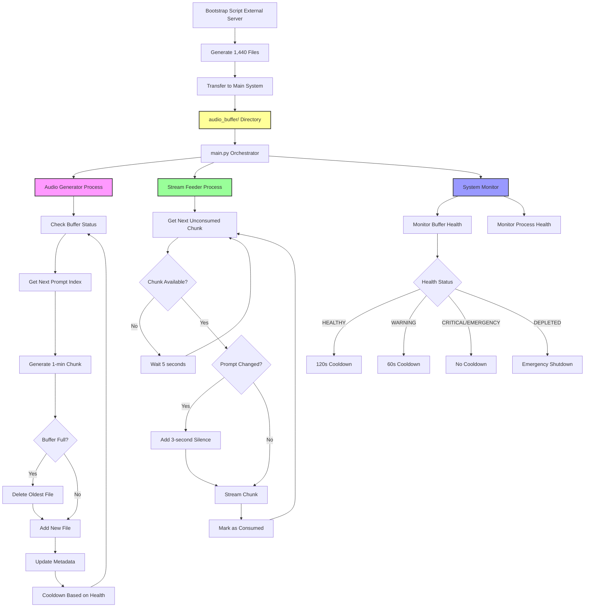

# Indian Lofi YouTube Live Stream System (Rolling Buffer)

## Overview
A 24/7 YouTube live stream system that generates continuous Indian lofi music using Meta's AudioCraft. The system maintains a **fixed rolling buffer of exactly 1,440 one-minute audio files** (1 week of content), continuously generating new content while automatically deleting the oldest files.

## System Architecture

```
[Bootstrap Generator] → [1,440 Files] → [Rolling Buffer] → [Stream Feeder] → [YouTube Live]
     (External Server)      (1 Week)       (Main System)
```

### Key Innovation: Rolling Buffer System
- **Fixed Size**: Always exactly 1,440 files (168 hours)
- **Continuous Refresh**: ~2 hours replaced daily at current generation speed
- **No Storage Growth**: Oldest files deleted when new ones are added
- **Instant Startup**: Pre-seeded with 1 week of content

## Detailed Workflow Diagram



## Rolling Buffer System Details

### **File Management Strategy**
```
/audio_buffer/ (Always exactly 1,440 files)
├── chunk_001_prompt_0_60s.wav    # Oldest file (will be deleted first)
├── chunk_002_prompt_0_60s.wav
├── ...
├── chunk_060_prompt_0_60s.wav    # End of first hour (prompt 0)
├── chunk_061_prompt_1_60s.wav    # Start of second hour (prompt 1) + 3-sec break
├── ...
├── chunk_1440_prompt_X_60s.wav   # Newest file
└── buffer_metadata.json          # Tracks all file states
```

### **Rolling Deletion Logic**
```python
# When buffer is full (1,440 files):
if len(buffer) >= 1440:
    delete_oldest_file()        # Remove chunk_001_*
    add_new_file()             # Add chunk_1441_*
    update_metadata()          # Keep JSON in sync
    
# Result: Always exactly 1,440 files, continuously refreshed
```

### **Prompt Rotation System**
- **Duration**: Each prompt plays for exactly 1 hour (60 chunks)
- **Rotation**: 10 prompts cycle every 10 hours, then repeat
- **3-Second Breaks**: Added only when prompt changes (every 60th chunk)
- **Seamless Within Prompt**: No breaks between chunks of same prompt

### **Buffer Health States**
| State | Hours Remaining | Cooldown | Behavior |
|-------|----------------|----------|----------|
| **HEALTHY** | >24 hours | 120 seconds | Normal operation |
| **WARNING** | 12-24 hours | 60 seconds | Faster generation |
| **CRITICAL** | 6-12 hours | 0 seconds | Continuous generation |
| **EMERGENCY** | 2-6 hours | 0 seconds | Continuous generation |
| **DEPLETED** | <2 hours | N/A | Emergency shutdown |

**Health Calculation**: `hours_remaining = unconsumed_chunks / 60`

## Implementation Components

### **1. Bootstrap Generation** (`bootstrap_1440_files.py`)
**Purpose**: Generate initial 1,440 files on external powerful server
**Output**: 
- 1,440 WAV files with proper naming convention
- Complete `buffer_metadata.json` with all chunk information
- Transfer instructions for main system

**Usage**:
```bash
# On powerful server (after AudioCraft setup):
python bootstrap_1440_files.py /path/to/audiocraft

# Example:
python bootstrap_1440_files.py /home/user/audiocraft

# Expected runtime: ~57 hours (2.4 min per chunk × 1,440 chunks)
# Output: bootstrap_output/ directory with all files
```

**Setup Requirements**:
1. AudioCraft repository cloned and installed
2. Virtual environment at `audiocraft/my_venv/`
3. Bootstrap script in any directory

### **2. Rolling Buffer Manager** (`buffer_manager.py`)
**Key Features**:
- **Startup Scan**: Automatically detects and catalogs existing files
- **Metadata Rebuild**: Reconstructs metadata.json from files if corrupted
- **Rolling Deletion**: Maintains exactly 1,440 files maximum
- **Health Monitoring**: Calculates buffer state based on unconsumed files

**Core Methods**:
- `add_chunk()`: Adds new file, deletes oldest if buffer full
- `get_next_chunk()`: Returns next file for streaming
- `get_buffer_status()`: Returns health state and statistics
- `enforce_buffer_limit()`: Ensures 1,440 file maximum

### **3. Continuous Audio Generator** (`audio_generator.py`)
**New Behavior**:
- **Always Generates**: Continuous operation regardless of buffer state
- **Rolling Addition**: New chunks replace oldest automatically
- **Adaptive Cooldown**: Variable sleep based on buffer health
- **Prompt Sequencing**: Handles 60-chunk prompt blocks automatically

**Generation Loop**:
```python
while True:
    status = check_buffer_health()
    prompt = get_next_prompt()           # Handles rotation
    chunk = generate_1min_audio(prompt)
    add_to_rolling_buffer(chunk)         # Auto-deletes oldest
    sleep(cooldown_based_on_health)
```

### **4. Stream Feeder** (`stream_feeder.py`)
**Unchanged Core Logic**: Streams chunks sequentially with 3-second breaks between prompts
**New Expectations**: Works with 1-minute chunks instead of 10-minute chunks

### **5. Configuration** (`config.py`)
```python
# Core Settings
CHUNK_DURATION = 60              # 1-minute chunks
MAX_BUFFER_FILES = 1440          # Fixed buffer size
CHUNKS_PER_PROMPT = 60           # 1 hour per prompt

# Cooldown System (replaces old break system)
COOLDOWN_TIMINGS = {
    "HEALTHY": 120,              # 2 minutes between generations
    "WARNING": 60,               # 1 minute between generations
    "CRITICAL": 0,               # Continuous generation
    "EMERGENCY": 0               # Continuous generation
}

# Health Thresholds (unchanged)
TARGET_BUFFER_HOURS = 24
WARNING_BUFFER_HOURS = 12
CRITICAL_BUFFER_HOURS = 6
EMERGENCY_BUFFER_HOURS = 2
```

## Setup and Deployment

### **Phase 1: Bootstrap Generation**
1. **Setup External Server** (powerful machine for initial generation)
2. **Install AudioCraft** on external server:
   ```bash
   # Clone AudioCraft
   git clone https://github.com/facebookresearch/audiocraft
   cd audiocraft
   
   # Create virtual environment
   python -m venv my_venv
   source my_venv/bin/activate
   
   # Install AudioCraft
   pip install -e .
   ```
3. **Copy Bootstrap Script** to external server:
   ```bash
   scp bootstrap_1440_files.py external-server:/path/to/bootstrap/
   ```
4. **Run Bootstrap Script**:
   ```bash
   # On external server
   python bootstrap_1440_files.py /path/to/audiocraft
   # Wait ~57 hours for completion
   ```
5. **Transfer Files to Main System**:
   ```bash
   # Transfer audio files
   rsync -av bootstrap_output/*.wav mainserver:/root/home_projects/youtube-stream/audio_buffer/
   
   # Transfer metadata
   scp bootstrap_output/buffer_metadata.json mainserver:/root/home_projects/youtube-stream/audio_buffer/
   ```

### **Phase 2: Main System Startup**
1. **Verify File Transfer**: Ensure 1,440 files in `audio_buffer/`
2. **Start System**:
   ```bash
   cd /root/home_projects/youtube-stream
   python main.py full
   ```
3. **System Behavior**:
   - Buffer manager scans existing files
   - Stream feeder begins immediate playback
   - Generator starts rolling refresh cycle

### **Phase 3: Continuous Operation**
- **Rolling Refresh**: ~1 new file every 2.4 minutes (at current generation speed)
- **Daily Replacement**: ~600 files replaced per day (41% of buffer)
- **Weekly Cycle**: Complete buffer refresh every ~2.4 days
- **CPU Management**: Automatic cooldowns prevent 100% CPU usage

## Performance Characteristics

### **Storage Requirements**
- **Fixed Size**: ~4.3GB total (1,440 × 3MB per file)
- **No Growth**: Storage usage remains constant
- **Predictable**: No cleanup or maintenance required

### **Generation Performance**
- **Current Speed**: 2.4 minutes per 1-minute chunk (0.42x realtime)
- **Daily Output**: ~600 new chunks (10 hours of fresh content)
- **Buffer Refresh Rate**: Complete turnover every 2.4 days
- **CPU Usage**: Reduced due to cooldown periods

### **Stream Characteristics**
- **Immediate Start**: No waiting for initial generation
- **Continuous Play**: 1 week of content always available (7-day safety buffer)
- **Prompt Blocks**: 1-hour segments per musical style
- **Seamless Transitions**: 3-second breaks only between prompts
- **Self-Sustaining**: 2 hours generated daily vs 24 hours consumed

## Monitoring and Health

### **Buffer Health Indicators**
```bash
# Check current status
python -c "from buffer_manager import BufferManager; print(BufferManager().get_buffer_status())"

# Expected output:
{
  "total_files": 1440,
  "available_chunks": 1200,
  "hours_remaining": 20.0,
  "health": "HEALTHY",
  "cooldown_seconds": 120,
  "buffer_full": true
}
```

### **System Monitoring**
- **File Count**: Always exactly 1,440 files
- **Health State**: HEALTHY → WARNING → CRITICAL → EMERGENCY → DEPLETED
- **Generation Rate**: ~1 file per 2.4 minutes
- **Consumption Rate**: 1 file per minute (during streaming)
- **Buffer Runway**: Hours of content remaining

## Troubleshooting

### **Common Issues**
1. **Buffer Not 1,440 Files**
   - Check file transfer completion
   - Verify buffer_manager.py enforcement logic
   - Rebuild metadata: `python -c "from buffer_manager import BufferManager; BufferManager().rebuild_metadata_from_files()"`

2. **Generation Stopped**
   - Check buffer health state
   - Verify AudioCraft installation
   - Check disk space and permissions

3. **Metadata Corruption**
   - System auto-rebuilds from files on startup
   - Manual rebuild: Delete `buffer_metadata.json`, restart system

4. **Stream Gaps**
   - Verify 3-second breaks only occur between prompts
   - Check chunk consumption rate vs generation rate

### **Debug Commands**
```bash
# Check buffer status
python main.py status

# List buffer files
ls -la audio_buffer/*.wav | wc -l  # Should be 1440

# Check metadata
python -c "import json; print(json.load(open('audio_buffer/buffer_metadata.json'))['chunks'][:5])"

# Test single generation
python -c "from audio_generator import AudioGenerator; AudioGenerator().generate_chunk('test prompt', '/tmp/test.wav')"
```

## Future Enhancements

### **Phase 2: YouTube Live Integration**
- FFmpeg integration for real streaming
- Animation loop overlay
- Stream health monitoring

### **Phase 3: Advanced Features**
- Web dashboard for monitoring
- Multiple quality streams
- Automated clip generation
- Analytics and metrics

## File Structure
```
youtube-stream/
├── config.py                    # System configuration
├── buffer_manager.py             # Rolling buffer management
├── audio_generator.py            # Continuous generation
├── stream_feeder.py              # Chunk streaming
├── main.py                      # System orchestrator
├── bootstrap_1440_files.py      # Initial file generation
├── requirements.txt             # Python dependencies
├── .gitignore                   # Git exclusions
├── README.md                    # This file
└── audio_buffer/                # 1,440 audio files + metadata
    ├── chunk_001_prompt_0_60s.wav
    ├── chunk_002_prompt_0_60s.wav
    ├── ...
    ├── chunk_1440_prompt_X_60s.wav
    └── buffer_metadata.json
```

## Success Metrics
- ✅ **Fixed Buffer Size**: Exactly 1,440 files maintained
- ✅ **Continuous Operation**: 24/7 streaming without interruption
- ✅ **Rolling Refresh**: Oldest content automatically replaced
- ✅ **CPU Efficiency**: Cooldown periods prevent overload
- ✅ **Instant Startup**: No waiting for initial generation
- ✅ **Predictable Storage**: Constant 4.3GB usage
- ✅ **Seamless Playback**: 1-hour prompt blocks with minimal breaks

The system transforms from a growing buffer with batch generation to a **fixed-size rolling buffer with continuous refresh**, providing reliable 24/7 operation with predictable resource usage.

## Performance Summary
- **Generation**: 120 files/day (2 hours audio) at 12 min/chunk
- **Consumption**: 1,440 files/day (24 hours audio) during streaming  
- **Buffer Size**: 5.47GB (1,440 × 3.8MB files)
- **Safety Margin**: 7-day runway if generation stops
- **Refresh Cycle**: Complete buffer turnover every 12 days