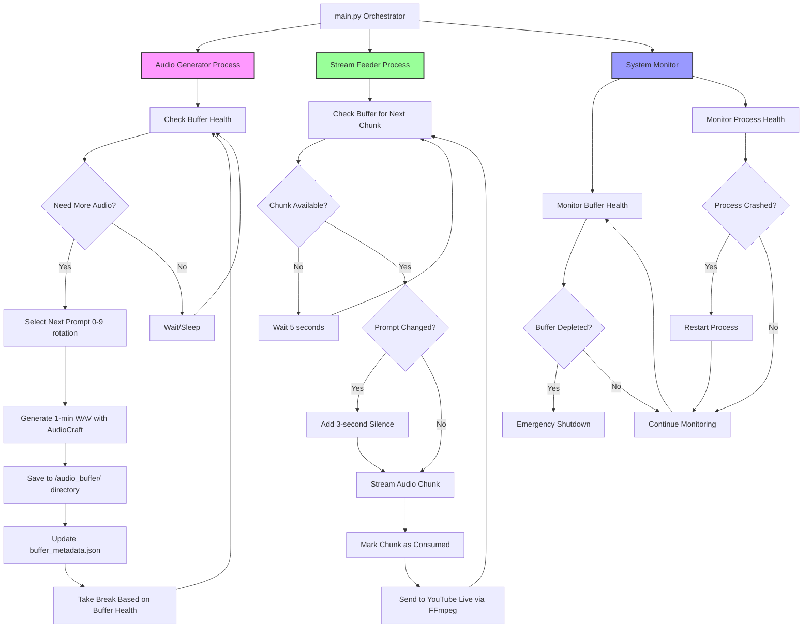

# Indian Lofi YouTube Live Stream System

## Overview
A 24/7 YouTube live stream system that generates continuous Indian lofi music using Meta's AudioCraft. The system pre-generates audio chunks to maintain a buffer, ensuring uninterrupted streaming despite slow generation times.

## System Architecture

```
[Audio Generator] → [Buffer Queue] → [Stream Feeder] → [YouTube Live]
                                  ↓
                              [Recording Capture]
```

### Key Components
- **Audio Generator**: Creates 10-minute lofi chunks using AudioCraft
- **Buffer Manager**: Manages chunk queue and health monitoring  
- **Stream Feeder**: Feeds chunks to YouTube with 3-second breaks between prompts
- **Main Orchestrator**: Coordinates all processes and handles failures

## Detailed Workflow Diagram



### Detailed Workflow Summary

## **Buffer System Architecture**
- **Queue Type**: File system + JSON metadata (NOT RabbitMQ or message queue)
- **Storage Location**: WAV files stored in `/audio_buffer/` directory
- **Metadata Tracking**: `buffer_metadata.json` tracks available vs consumed chunks
- **Cleanup Strategy**: Keeps last 10 consumed files, removes older ones automatically

## **Prompt Management Strategy**
- **Total Prompts**: 10 different Indian lofi styles
- **Prompt Duration**: Each prompt plays for **1 hour** before switching
- **Dynamic Calculation**: `CHUNKS_PER_PROMPT = (1 hour * 3600 seconds) / CHUNK_DURATION`
  - 1-minute chunks = 60 chunks per prompt
  - 5-minute chunks = 12 chunks per prompt  
  - 10-minute chunks = 6 chunks per prompt
- **Rotation**: Cycles through prompts 0→1→2→...→9→0 after each hour
- **3-Second Breaks**: Only added when switching between different prompts (every hour)

## **Process Triggering & Execution**

### **main.py Orchestrator**
- **Startup**: Immediately launches both generator and feeder processes
- **Not Cron-Based**: Continuous running processes, not scheduled jobs
- **Process Management**: Monitors and restarts crashed processes
- **Health Monitoring**: Checks buffer status every minute

### **Audio Generation Loop (Continuous)**
```
while True:
    1. Check buffer health (HEALTHY/WARNING/CRITICAL/DEPLETED)
    2. If buffer needs chunks → generate next chunk in current prompt sequence
    3. Save WAV file to /audio_buffer/ directory
    4. Update buffer_metadata.json with new chunk info
    5. Take break based on buffer health:
       - HEALTHY: 5-minute break
       - WARNING: 2-minute break  
       - CRITICAL/EMERGENCY: No break, continuous generation
    6. Repeat loop
```

### **Stream Feeding Loop (Continuous)**
```
while True:
    1. Check buffer for next unconsumed chunk
    2. If no chunks available → wait 5 seconds, retry
    3. If chunk available:
       a. Check if prompt changed from previous chunk
       b. If prompt changed → add 3-second silence
       c. Stream audio chunk (currently simulated, Phase 2 = FFmpeg→YouTube)
       d. Mark chunk as consumed in metadata
    4. Repeat loop
```

## **Buffer Health States**
- **HEALTHY**: >24 hours of audio remaining → 5-minute breaks between generation
- **WARNING**: 12-24 hours remaining → 2-minute breaks
- **CRITICAL**: 6-12 hours remaining → No breaks, continuous generation
- **EMERGENCY**: 2-6 hours remaining → No breaks, continuous generation
- **DEPLETED**: <2 hours remaining → Emergency shutdown of stream

## **File System Organization**
```
/audio_buffer/
├── chunk_001_prompt_0_60s.wav    # First chunk of prompt 0
├── chunk_002_prompt_0_60s.wav    # Second chunk of prompt 0
├── ...                           # (58 more chunks of prompt 0)
├── chunk_060_prompt_0_60s.wav    # Last chunk of prompt 0 (1 hour complete)
├── chunk_061_prompt_1_60s.wav    # First chunk of prompt 1 (3-sec break added here)
├── chunk_062_prompt_1_60s.wav    # Second chunk of prompt 1
└── buffer_metadata.json          # Tracks all chunk status
```

## **Key Configuration (config.py)**
- **CHUNK_DURATION**: Duration of each audio chunk (60s, 300s, 600s, etc.)
- **PROMPT_DURATION_HOURS**: How long each prompt plays (1 hour)
- **CHUNKS_PER_PROMPT**: Dynamically calculated based on chunk duration
- **TARGET_BUFFER_HOURS**: Target buffer size (24 hours)
- **PROMPTS[]**: Array of 10 Indian lofi prompt variations

## **Process Responsibilities**
- **main.py**: Process orchestration, health monitoring, emergency shutdown
- **audio_generator.py**: AudioCraft integration, WAV file creation, prompt sequencing
- **stream_feeder.py**: Chunk streaming, break insertion, consumption tracking
- **buffer_manager.py**: File queue management, metadata persistence, cleanup
- **config.py**: All settings, prompts, and dynamic calculations

## Current Status: Phase 1 Complete ✅

### What's Been Built
1. **Core Buffer System** - File-based queue with JSON metadata tracking
2. **10 Indian Lofi Prompts** - Each plays for 1 hour before rotation
3. **Dynamic Prompt Management** - Calculates chunks per prompt based on duration
4. **Health Monitoring** - 5 buffer states with adaptive generation breaks
5. **Process Coordination** - Continuous loops for generation and streaming
6. **Cleanup System** - Automatic removal of old consumed chunks
7. **Testing Framework** - Comprehensive testing tools for all components

### Files Created
```
youtube-stream/
├── config.py              # Settings, prompts, paths
├── buffer_manager.py       # Buffer queue management
├── audio_generator.py      # AudioCraft chunk generation  
├── stream_feeder.py        # Chunk streaming with breaks
├── main.py                # Main orchestrator
├── test_phase1.py         # Testing utilities
├── README.md              # This file
└── audio_buffer/          # Generated chunks storage
```

## Performance Metrics
- **Generation Speed**: ~24 minutes to create 10-minute chunk (0.42x realtime)
- **Target Buffer**: 24 hours (144 chunks)
- **CPU Usage**: ~90% during generation
- **Memory**: ~4GB for AudioCraft small model

## Testing Phase 1

### Prerequisites
- AudioCraft installed at `/root/home_projects/audiocraft/`
- Python virtual environment at `/root/home_projects/audiocraft/my_venv/`
- 60GB RAM, 12 CPU cores (your current setup)
- Working directory: `/root/home_projects/youtube-stream/`

### Test Commands
```bash
cd /root/home_projects/youtube-stream

# Test individual components
python test_phase1.py buffer     # Test buffer manager
python test_phase1.py generate   # Generate 1 chunk (~24 mins) - FIXED
python test_phase1.py stream     # Test streaming
python test_phase1.py status     # Show buffer contents

# Run full system
python main.py full              # Both generator + feeder
python main.py generator-only    # Just generate chunks
python main.py feeder-only       # Just stream chunks
```

### Recent Fixes
- **Generator Logic**: Fixed to allow initial generation when buffer is empty
- **Test Generation**: Now creates focused single-chunk test instead of full loop

### Expected Test Results
1. **Buffer Manager**: Prompt rotation, health monitoring working
2. **Audio Generation**: One 10-minute WAV file created in `audio_buffer/`
3. **Stream Feeder**: Simulated streaming with 3-second breaks
4. **Full System**: Both processes running, buffer health updating

## What You Need to Do

### Immediate (Phase 1 Testing)
1. **Run tests** to verify Phase 1 works on your system:
   ```bash
   cd /root/home_projects/youtube-stream
   python test_phase1.py buffer    # Should show prompt rotation
   python test_phase1.py generate  # Will take ~24 minutes
   python test_phase1.py status    # Should show 1 generated chunk
   ```
2. **Monitor CPU usage** during generation (should be ~90%)
3. **Check audio quality** of generated chunks in `audio_buffer/`
4. **Report any errors** or performance issues

### For Phase 2 (Next Steps)
1. **YouTube Live Setup**:
   - Create YouTube Live stream
   - Get RTMP URL and stream key
   - Install FFmpeg for video encoding

2. **Animation Preparation**:
   - Provide your 8-second animation file
   - Specify format (MP4, GIF, etc.)

3. **External Server Bootstrap** (Optional):
   - Set up external server for initial 24-hour generation
   - Configure file transfer method (rsync, scp)

## Upcoming Phases

### Phase 2: Production Streaming
- **FFmpeg Integration**: Real YouTube Live streaming
- **Animation Loop**: Your 8-second video on repeat
- **CPU Management**: Adaptive generation based on load
- **Process Recovery**: Auto-restart on failures

### Phase 3: Recording System  
- **Stream Capture**: Record variable-length segments (1hr, 30min, 4hr)
- **Auto-Upload**: Separate YouTube video uploads
- **File Management**: Cleanup and storage optimization

### Phase 4: Monitoring & Optimization
- **Web Dashboard**: Real-time system monitoring
- **Performance Tuning**: CPU optimization, faster generation
- **Alerting**: Email/SMS notifications for issues
- **Analytics**: Stream metrics and performance data

## Configuration Options

### Buffer Settings (config.py)
```python
TARGET_BUFFER_HOURS = 24    # Target buffer size
CHUNK_DURATION = 600        # 10-minute chunks
MODEL_SIZE = "small"        # AudioCraft model size
```

### Buffer Health Levels
- **HEALTHY**: >24 hours → 5-minute breaks between generation
- **WARNING**: 12-24 hours → 2-minute breaks
- **CRITICAL**: 6-12 hours → No breaks
- **EMERGENCY**: 2-6 hours → No breaks
- **DEPLETED**: <2 hours → Stop stream

## Troubleshooting

### Common Issues
1. **Generation Fails**: Check AudioCraft installation, Python path
2. **High CPU Usage**: Expected during generation, will add throttling in Phase 2
3. **Buffer Not Growing**: Check disk space, file permissions
4. **Process Crashes**: Check logs, memory usage

### Debug Commands
```bash
# Check buffer status
python main.py status

# View generated files
ls -la audio_buffer/

# Test single generation
python test_phase1.py generate

# Clean up test data
python test_phase1.py cleanup
```

## Next Steps
1. **Complete Phase 1 testing** and report results
2. **Prepare YouTube Live credentials** for Phase 2
3. **Provide animation file** for video stream
4. **Decide on external server** for bootstrap generation

The system is designed to be robust and handle the slow generation speed through intelligent buffering. Once Phase 2 is complete, you'll have a fully functional 24/7 Indian lofi stream!